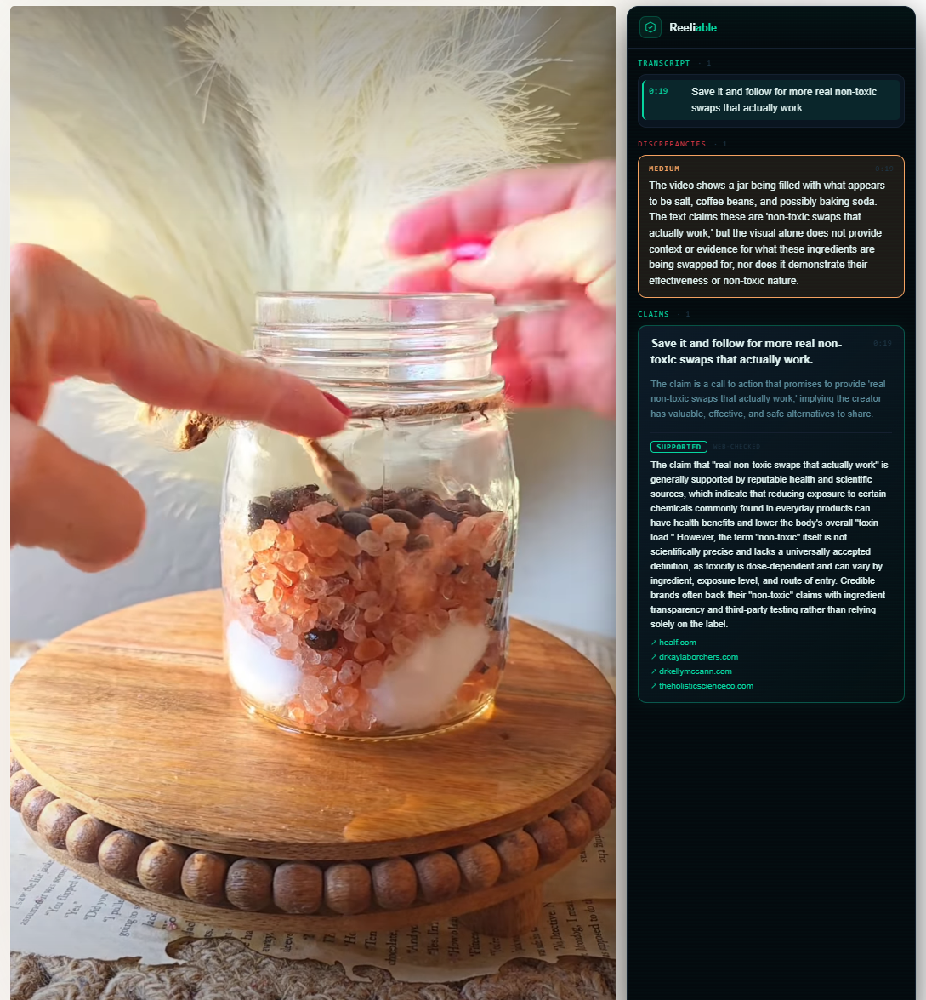
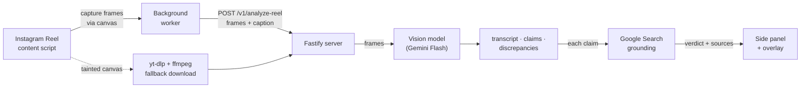

<div align="center">


# Reeliable

### Catch health misinformation before it catches you.

Reeliable watches Instagram Reels **as you scroll** and fact-checks every claim
against the **live web** — verdicts, discrepancies, and sources, in real time.

<br/>


</div>

<div align="center">
  
  <p><em>Live verdicts, discrepancy alerts, and web sources — rendered in the side panel as the Reel plays.</em></p>
</div>

---

## ✨ Features

- 🎥 **Real-time, as you scroll** — detects the active Reel and analyzes it automatically; no clicks, no copy-paste.
- 🧠 **Multimodal claim extraction** — a vision-language model reads on-screen text, products, and visuals across sampled frames.
- 🔎 **Web-grounded verdicts** — every claim is checked against live Google Search results: *supported · contradicted · partially true · unverified*, each with source links.
- ⚠️ **Discrepancy detection** — flags mismatches between what's *shown*, what's *written*, and what's *claimed* on screen.
- 🍪 **No cookies, no downloads** — frames are captured straight from the playing video in your authenticated tab, so the server never needs to log in to Instagram or re-download anything.
- 🔌 **Pluggable & free to run** — any OpenAI-compatible VLM behind 3 env vars (Google Gemini Flash free-tier by default, or OpenRouter / Groq / local Ollama).
- 🪟 **Clean side-panel UI** — timestamp-synced transcript, claim cards, and severity-tagged alerts, shared between the side panel and an in-page overlay.

---

## 🛠 How It Works



1. A content script finds the most-visible Reel (by viewport-intersection area) and resolves its shortcode from the URL/DOM — falling back to a **MAIN-world script that walks Instagram's React fiber tree** when the markup hides it.
2. **Primary path:** it captures ~8 frames directly from the playing `<video>` via an off-screen canvas — reusing your authenticated session, so **the server never needs Instagram cookies or to download anything.** Frames + caption are POSTed to the local server.
3. **Fallback path:** if the canvas is cross-origin-tainted, the server downloads the reel with `yt-dlp`, extracts frames with `ffmpeg`, and (optionally) transcribes the audio with Groq Whisper.
4. The frames go to a pluggable, OpenAI-compatible **vision model** (Gemini Flash by default), which returns a timestamped **on-screen-text transcript**, notable **claims**, and visual/textual **discrepancies**.
5. Each claim is optionally **web-grounded** via Gemini's Google Search into a verdict *(supported / contradicted / partially true / unverified)* with source links.
6. Results are cached by `reelId` and rendered, timestamp-synced, in an in-page overlay and the side panel.

---

## 🧰 Tech Stack

| Layer | Tech |
|---|---|
| **Extension** | Chrome MV3, React 18, TypeScript, Vite (multi-entry: isolated + MAIN world) |
| **Server** | Fastify, TypeScript, tsx |
| **Vision model** | Pluggable OpenAI-compatible VLM — Gemini Flash (default) · OpenRouter · Groq · local Ollama |
| **Fact-checking** | Gemini Google Search grounding |
| **Media (fallback)** | yt-dlp + ffmpeg, optional Groq Whisper |
| **Tooling** | pnpm workspace, strict TypeScript end-to-end |

---

## 🧠 Engineering Highlights

- **Cookie-free capture.** Frames are read from the already-playing `<video>` in the authenticated tab via canvas — sidestepping Instagram auth entirely — with **tainted-canvas detection** and a graceful server-download fallback.
- **Fiber-tree shortcode resolution.** A MAIN-world script walks Instagram's React fiber tree to recover reel IDs reliably even though the player uses opaque `blob:` MSE URLs.
- **Provider-agnostic VLM.** One OpenAI-compatible client swaps between Gemini / OpenRouter / Groq / Ollama with zero code changes.
- **Resilient by design.** Exponential-backoff retries on `429/5xx`, non-JSON model output degrades to an empty state (never an error card), and per-claim grounding failures are isolated.
- **Bounded everything.** Output is sanitized and capped (claims/transcript/discrepancies); the server and background worker use bounded LRU caches with `AbortController` cancellation when the reel changes mid-flight.
- **Timestamp-synced shared UI.** The transcript auto-scrolls and claims reveal as playback reaches their timestamp, from a single component set shared by the side panel and a shadow-DOM overlay.

---

## 🚀 Quick Start

**Prerequisites:** Node 20+, pnpm 9+. (`yt-dlp` + `ffmpeg` are only needed for the download *fallback* — not for normal use.)

```bash
# 1. Install
pnpm install

# 2. Configure — default provider is Google Gemini Flash (free tier)
cp .env.example .env
#   then add your key:  VLM_API_KEY=...   (get one free at https://aistudio.google.com/apikey)

# 3. Run the server
cd server && pnpm dev          # http://localhost:3001

# 4. Build the extension
cd extension && pnpm build     # outputs extension/dist
```

**5. Load it in Chrome:** open `chrome://extensions` → enable **Developer mode** → **Load unpacked** → select `extension/dist`. Open Instagram and start scrolling Reels — the side panel populates automatically.

> Swap providers (OpenRouter / Groq / local Ollama) by changing the `VLM_*` vars — see [`.env.example`](.env.example).

---

## 🖥 UI Preview (no extension or server needed)

See the real side-panel UI with mock data:

```bash
cd packages/preview && pnpm dev   # http://localhost:5173
```

---

## 📡 API Reference

<details>
<summary><strong>POST /v1/analyze-reel</strong> — request &amp; response schema</summary>

**Request** (the extension sends `frames`; `videoUrl` is used only for the download fallback):

```json
{
  "reelId": "abc123",
  "creator": "@creator",
  "videoUrl": "https://www.instagram.com/reels/abc123/",
  "caption": "optional caption text",
  "frames": [{ "base64": "<jpeg>", "timestampMs": 0 }]
}
```

**Response:**

```json
{
  "reelId": "abc123",
  "transcript": [{ "text": "on-screen line", "timestampMs": 2000 }],
  "claims": [
    {
      "id": "claim-1",
      "text": "claim text",
      "reasoning": "why it's notable",
      "authorSources": ["source named on screen"],
      "timestampMs": 4000,
      "verdict": {
        "status": "contradicted",
        "summary": "plain-language verdict",
        "sources": [{ "title": "nih.gov", "url": "https://..." }]
      }
    }
  ],
  "discrepancies": [
    { "description": "visual/text mismatch", "frameTimestampMs": 6000, "severity": "medium" }
  ]
}
```

</details>

---

## 📦 Project Structure

```
reeliable/
├── extension/        # Chrome MV3 extension (content script, MAIN-world fiber walker,
│                     #   background worker, shared React UI, side panel + overlay)
├── server/           # Fastify API: frame analysis → pluggable VLM → Google-Search grounding
└── packages/preview/ # Standalone UI preview with mock data
```

---

## ⚠️ Limitations

- **Free-tier quotas.** The default Gemini free tier rate-limits under heavy use (mitigated by backoff + caching); swap models/providers or add billing for more headroom.
- **Brittle to layout changes.** Reel detection scrapes Instagram's DOM/fiber tree, which can break when Instagram ships UI changes.
- **On-screen text, not audio.** The transcript is OCR-style on-screen text; audio-only claims require the optional Whisper path (download fallback).
- **Research / portfolio project — not medical advice.** Verdicts are model-generated and may be wrong.

---

## 📄 License

[MIT](LICENSE) © Ahmet Dokmeci
